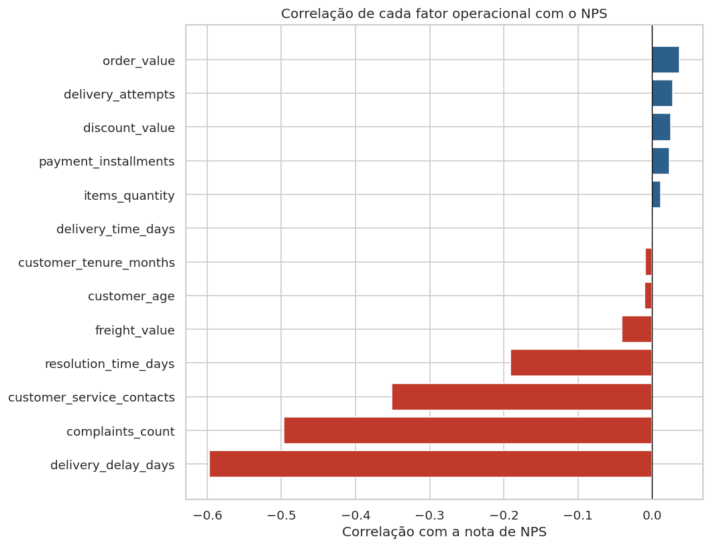

# PÓS-TECH AI SCIENTIST - FASE 1

Este repositório contém o desenvolvimento do Tech Challenge Fase 1 – POS TECH, cujo objetivo é analisar dados de pedidos, entregas e interações de clientes em um e-commerce para compreender os fatores que influenciam a satisfação (NPS) e propor recomendações estratégicas para melhorar a experiência do cliente.

---

## Estrutura do Repositório

```
POSTECH_AI_SCIENTIST_FASE1/
│
├── data/
│   ├── raw/
│   │   └── desafio_nps_fase_1.csv        # Base com TODOS os 2.500 registros de NPS
│   └── processed/
│       └── nps_processed.csv             # Base gerada pelo notebook 02
│
├── notebooks/
│   ├── 01_analise_eda.ipynb              # Entendimento do negócio + EDA
│   ├── 02_feature_engineering.ipynb      # Pré-processamento e criação de features
│   └── 03_modelo_preditivo.ipynb         # Modelos de regressão e classificação
│
├── models/                               # Modelos serializados (gerados pelo notebook 03)
│   ├── nps_regressor.pkl
│   ├── nps_classifier.pkl
│   ├── label_encoder.pkl
│   ├── scaler.pkl
│   └── feature_names.pkl
│
├── reports/
│   └── figures/                          # Gráficos gerados pelos notebooks
│
├── docs/
│   └── 1IAST_Fase1_TechChallenge.pdf     # Enunciado original do desafio
│
├── .gitignore
├── requirements.txt
└── README.md
```

### Por que essa estrutura?

| Pasta | Responsabilidade |
|---|---|
| `data/raw/` | Dados originais.|
| `data/processed/` | Dataset gerado pelo pipeline de pré-processamento. |
| `notebooks/` | Análise sequencial e reproduzível, numerada por ordem de execução. |
| `models/` | Modelos treinados prontos para inferência. |
| `reports/figures/` | Gráficos exportados para relatórios e apresentações gerenciais. |

---

## Objetivo do Projeto

Uma empresa de e-commerce identificou alta variabilidade no NPS entre seus clientes e precisava entender quais fatores operacionais realmente fazem a diferença na experiência de compra.

**Pergunta central:**
Quais fatores operacionais realmente influenciam a satisfação do cliente e como a empresa pode agir de forma **proativa**, antes mesmo da aplicação da pesquisa de NPS?

---

## Descrição da Base de Dados

**Arquivo:** `data/raw/desafio_nps_fase_1.csv`

O dataset contém 2.500 registros de clientes com informações coletadas ao longo da jornada de compra, abrangendo dados de pedido, logistíca, atendimento e satisfação.

| Coluna | Tipo | Descrição | Leakage? |
|---|---|---|---|
| `customer_id` | int | Identificador único do cliente | — |
| `order_id` | int | Identificador único do pedido | — |
| `customer_age` | int | Idade do cliente | — |
| `customer_region` | str | Região geográfica (5 regiões do Brasil) | — |
| `customer_tenure_months` | int | Tempo de relacionamento com a empresa (meses) | — |
| `order_value` | float | Valor total do pedido (R$) | — |
| `items_quantity` | int | Quantidade de itens no pedido | — |
| `discount_value` | float | Valor do desconto aplicado (R$) | — |
| `payment_installments` | int | Número de parcelas do pagamento | — |
| `delivery_time_days` | int | Tempo total de entrega (dias) | — |
| `delivery_delay_days` | int | Dias de atraso em relação ao prazo prometido | — |
| `freight_value` | float | Valor do frete (R$) | — |
| `delivery_attempts` | int | Número de tentativas de entrega | — |
| `customer_service_contacts` | int | Contatos do cliente com o suporte | — |
| `resolution_time_days` | int | Tempo para resolução de problemas (dias) | — |
| `complaints_count` | int | Número de reclamações registradas | — |
| `repeat_purchase_30d` | int | Recompra em até 30 dias (0/1) | ⚠️ **SIM** |
| `csat_internal_score` | float | Score interno de satisfação | ⚠️ **SIM** |
| `nps_score` | float | **Variável-alvo** — nota NPS de 0 a 10 | — |

> Colunas marcadas com **SIM** são excluídas do modelo por risco de **data leakage** — elas só existem após o evento que queremos prever.

---

## Metodologia

### Notebook 01 — Análise e EDA
- Entendimento do problema de negócio e importância do NPS;
- Definição da variável-alvo e identificação do risco de data leakage;
- Análise exploratória completa com 6 achados principais:
  - Distribuição do NPS Score (NPS líquido = -66);
  - Matriz de correlação com fatores operacionais;
  - Ponto de ruptura: a partir de **2 dias de atraso**, mais de 75% dos clientes viram detratores;
  - Efeito combinado de atraso + reclamações;
  - Análise por região geográfica.

### Notebook 02 — Feature Engineering
- Remoção de colunas com data leakage (`csat_internal_score`, `repeat_purchase_30d`);
- Encoding de variáveis categóricas (One-Hot Encoding em `customer_region`);
- Criação de novas features: `discount_ratio`, `has_delay`, `high_contact`, `freight_per_item`;
- Geração do dataset processado `nps_processed.csv`.

### Notebook 03 — Modelo Preditivo
Duas abordagens testadas e comparadas:

**Regressão** (target: `nps_score` contínuo):

| Modelo | MAE | RMSE | R² |
|---|---|---|---|
| Regressão Linear | ~1.34 | ~1.69 | ~0.55 |
| Gradient Boosting Regressor | ~1.36 | ~1.70 | ~0.54 |
| Random Forest Regressor | ~1.40 | ~1.75 | ~0.52 |

**Classificação** (target: Detrator / Neutro / Promotor):

| Modelo | Acurácia | F1-Macro |
|---|---|---|
| Logistic Regression | ~0.69 | ~0.54 |
| Gradient Boosting | ~0.78 | ~0.52 |
| Random Forest | ~0.76 | ~0.51 |
| Decision Tree | ~0.64 | ~0.48 |
| SVM | ~0.69 | ~0.53 |

---

## Insights da Análise Exploratória de Dados



| Fator | Correlação com NPS | Insight |
|---|---|---|
| `delivery_delay_days` | **−0.60** | Principal driver de insatisfação |
| `complaints_count` | **−0.50** | Reclamações destroem o NPS |
| `customer_service_contacts` | **−0.35** | Múltiplos contatos frustram o cliente |

**Ponto de ruptura:** a partir de 2 dias de atraso, mais de 75% dos clientes tornam-se detratores. Com 3 ou mais dias, o NPS médio cai abaixo de 3.5 e os detratores passam de 90%.

---

## Como Reproduzir os Resultados

### Pré-requisitos
- Python 3.10+ **ou** conta no Google Colab (sem instalação)
- Git

### Opção 1 — Google Colab (recomendado)

1. Abra cada notebook no Colab em ordem
2. Execute a célula de setup e faça upload dos arquivos necessários
3. Execute todas as células (Runtime → Run all)
4. Baixe os arquivos gerados pela célula final

**Ordem de execução e arquivos necessários:**

| Notebook | Precisa de | Gera |
|---|---|---|
| 01 | `desafio_nps_fase_1.csv` | Gráficos da EDA |
| 02 | `desafio_nps_fase_1.csv` | `nps_processed.csv` |
| 03 | `nps_processed.csv` | Gráficos dos modelos + arquivos `.pkl` |

### Opção 2 — Ambiente local

```bash
# 1. Clone o repositório
git clone https://github.com/GabrielFontineles/POSTECH_AI_SCIENTIST_FASE1.git
cd POSTECH_AI_SCIENTIST_FASE1

# 2. Crie um ambiente virtual
python -m venv venv
source venv/bin/activate        # Linux/macOS
venv\Scripts\activate           # Windows

# 3. Instale as dependências
pip install -r requirements.txt

# 4. Inicie o JupyterLab
jupyter lab
```

Execute os notebooks **nessa ordem**: 01 → 02 → 03.

---

## Boas Práticas Aplicadas

| Prática | Como foi implementada |
|---|---|
| **Código organizado** | Notebooks numerados por etapa com responsabilidade clara |
| **Nomes claros** | Snake_case em todas as variáveis |
| **Comentários** | Cada bloco de código tem comentário explicativo |
| **Estrutura de pastas** | `data/`, `notebooks/`, `models/`, `reports/` |
| **README completo** | Objetivo, dados, metodologia e como reproduzir |
| **Controle de leakage** | Exclusão documentada das colunas `csat_internal_score` e `repeat_purchase_30d` |
| **Reprodutibilidade** | `random_state=42` em todos os modelos e splits |

---

## 👥 Integrantes

Tech Challenge — Fase 1 | PosTech | 2026
